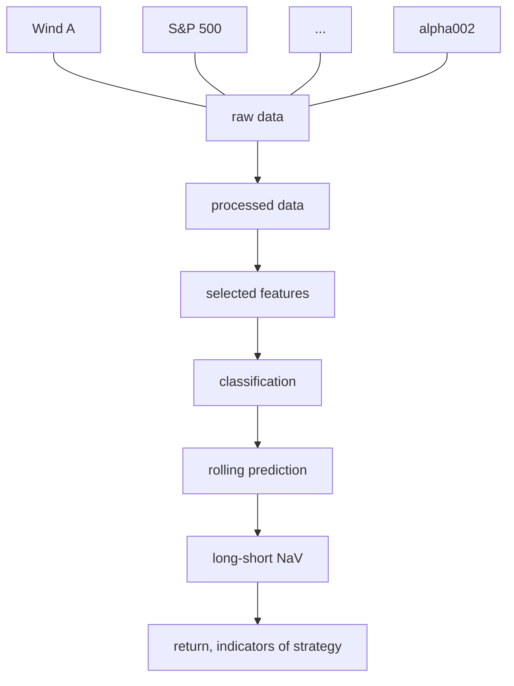

# PHBS_ML_for_quant_project
This is the repository for ML final project.

### 0.Team Member

| Name                | Student ID | GitHub                                          |
| ------------------- | ---------- | ----------------------------------------------- |
| Yifan Hu/Evan       | 1901212691 | [eiahb3838ya](https://github.com/eiahb3838ya)   |
| Yuting Fang/Trista  | 1901212576 | [ytfang222](https://github.com/ytfang222)       |
| Zhihao Chen/Alfred  | 1901212567 | [AlfredChenZH](https://github.com/AlfredChenZH) |
| Zilei Wang/ Lorelei | 1901212645 | [LoreleiWong](https://github.com/LoreleiWong)   |

### PART1 Introduction

#### 1.1 Motivation

As the global financial market is generating mass data of different types every day, it is becoming more crucial and more **difficult to effectively extract and use these data to predict the trend of stocks**. The short-term timing strategy has a few difficulties, a few of which are listed as follows:

1. Market sentiments strongly influence the short-term market trend;
2. How to extract effective factors;
3. How to build nonlinear factors;
4. How to solve collinearity among factors.

#### 1.2 Our project goal

In this project, we recognize the **price up or down** as a **classification problem** and implement several **machine learning algorithms** to predict the future price up or down of **WindA Index(Y)**([881001.csv](http://localhost:8888/notebooks/Postgraduate/Module3/Machine Learning for Finance/PHBS_ML_for_quant_project/09 for Pre Part/00 data/881001.csv)), an index indicating the trend of Chinese A Share stocks, to build a **short-term timing strategy**.

#### 1.3 Brief Summary of Dataset[¶](http://localhost:8888/notebooks/Postgraduate/Module3/Machine Learning for Finance/PHBS_ML_for_quant_project/09 for Pre Part/ML_project_Part_1%2B2.ipynb#1.3-Brief-Summary-of-Dataset)

The X (dataset) consists of three parts: **macroeconomic data in china**([cleanedFactor.pkl](http://localhost:8888/notebooks/Postgraduate/Module3/Machine Learning for Finance/PHBS_ML_for_quant_project/09 for Pre Part/00 data/cleanedFactor.pkl)), **American index indicators**, like ([DJI.GI,NQ.CME](http://localhost:8888/notebooks/Postgraduate/Module3/Machine Learning for Finance/PHBS_ML_for_quant_project/09 for Pre Part/00 data/AddNewData)) and some alpha factors built using OHLC prices of WindA as in WorldQuant101.
The Y is 0/1 **boolean value indicating fall/rise of windA** in next trading day.
The total number of features is 60.
The time period: from 20080401 to 20200306.
The data can be acquired from Wind Database directly. All factors are based on daily frequency data.

#### 1.4 Dataset sample

Here is a sample of the dataset.

Figure 1. Sample data

#### 1.5 Work flow

We implement a feature selection to choose 18 features (factors) out of 52 daily factor data and 8 alpha factors from WorldQuant101 to establish classifiers using logistic regression, naive Bayes, KNN, perceptron, decision tree, SVM, XGBoost and a Sequential neural network model in Keras to predict the rise or fall of Wind All A Index the next day. Then we The whole work flow is shown in Figure 2.

Figure 2. Work flow of the project

#### 1.6 Rolling Prediction

As the financial data are time series data, we implement an **expanding window** training and prediction procedure as follows: 

1. We get at least 1800 days' data as the training dataset and use k-fold cross validation method to tune the hyperparameters for the best model, so the first signal we can get is the 1801 day.
2. The signal is the predict results of the up or down of WindA Index in the next day. If the signal is predicted to be 1, then we buy WindA Index at the close of the day. If it is predicted as 0, then we short WindA or do nothing at the close of the day.
3. We use the best model in Step 2 for 20 consecutive trading days and then add the 20 days' data into the training set in Step 1 to enter Step 1 again.

Figure 3. Flow chart of the expanding window backtest model for short-term timing strategy

As we can see from Figure 3, every 20 consecutive trading days the training dataset will expand 20 more days' data.

We will also use CSCV framework to evaluate the probability of overfitting in backtesting level.

### Data Preprocessing and Feature Selection

#### 2.1 Data Collection

The goal of our timing model is to forecast Wind All A Index, using 60 factors including interest rate factors, commodity factors and other factors. And the time range of our data is from April 1, 2008 to March 6, 2020.

Except for the factors chosen in our reference research report, we add two kinds of features. One of them is Shanghai Composite Index, which is a good indicator that reflects Chinese stock market expectations. The other is stock indexes of foreign stock market, including Nikkei Index and three American stock indexes, because we believe that the volatility of foreign stock prices can have a significant influence on Chinese market.

We also establish eight alpha factors using OHLC prices of WindA index following WorldQuant101. An example is

#### 3.Data clean details

1. **Data formats, structures**
   design a process for data cleaning. Remove NA values and make the format easy to slice according to time. Use dict and pandas dataframe to design our structure.
2. **Data Normalization**
   design a class for normalization work, which provides method including loading , calculating, saving data according to parameters given. At least implement two kinds of normalization, including min-max, z-score normalization.

#### 4. Explore and analysis data:

The description of dataset is in [report](08%20report/inputDataReport.html).

1. **Visualiztion**
   to check if our data follow required statistical assumptions, we will visualize our data using seaborn or other tools. Draw a heat map to check the corr_coef of each factors. 

2. **Feature engineering** use tech indicator to build some factor like wq101.

3. **Feature selection**
   to check which factors have better prediction power. We will apply feature selection methods including Cross Entropy, information gain, gini coef, LASSO. Draw the graph for each factor accordingly 

   Now(naive，SVCL1，tree，varianceThreshold，PCA)

4. **Check the efficiency of features** (waiting to do) calculate the IC

5. **Decomposition** We can try PCA method to avoid dimension disaster, pick the top 5, 10 vectors as our feature to input.

#### 5. Single Model to classifier

do cv. turning the hyperpramaters.

total num is  7 base classifier models.(Logistic Regression, SVM, KNN, Naive Bayes, NeuralNetwork,Perceptron,Decision Tree)

print output roc,auc,etc

#### 6.Boosting Model to implement model

XGBoost model performance is reeeeally good.

#### 7.Deep Learning algos to predict

Use sequential Model to make classifier. This case is not very suitable for deep learning algos because of small size of dataset.

#### 8.Evaluation overfitting framework

CSCV cross validation framework to evaluate the overfitting rate of each method.

#### Reference

Mingming Yu, Min Guan. (2019). Systematic Asset Allocation Series III of Xingye Securities: A Short-Term Market Timing Strategy Based on AdaBoost Machine Learning Algorithms. Xingye Securities.

Xiaoming Lin, Ye Chen. (2019). Artificial Intelligence Series XXII of Huatai Securities: Probability of Backtest Overfitting Based on CSCV Framework. Huatai Securities.

Zura Kakushadze. (2016). 101 formulaic alphas. *Social Science Electronic Publishing*, *2016*(84), 72–81.

meeting log url:https://hackmd.io/maqBPlJXQCuxeWJi7ga5AA?both
