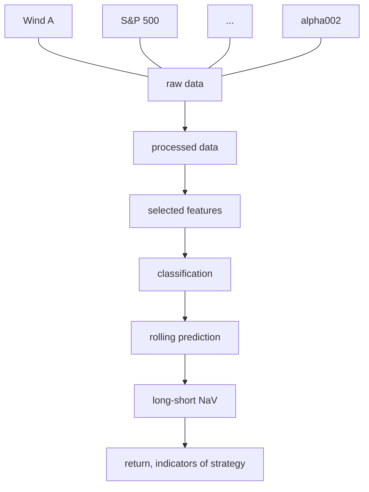

# PHBS_ML_for_quant_project
This is the repository for ML final project.

### 0.Team Member

| Name                | Student ID | GitHub                                          |
| ------------------- | ---------- | ----------------------------------------------- |
| Yifan Hu/Evan       | 1901212691 | [eiahb3838ya](https://github.com/eiahb3838ya)   |
| Yuting Fang/Trista  | 1901212576 | [ytfang222](https://github.com/ytfang222)       |
| Zhihao Chen/Alfred  | 1901212567 | [AlfredChenZH](https://github.com/AlfredChenZH) |
| Zilei Wang/ Lorelei | 1901212645 | [LoreleiWong](https://github.com/LoreleiWong)   |

### PART1 Introduction

#### 1.1 Motivation

As the global financial market is generating mass data of different types every day, it is becoming more crucial and more **difficult to effectively extract and use these data to predict the trend of stocks**. The short-term timing strategy has a few difficulties, a few of which are listed as follows:

1. Market sentiments strongly influence the short-term market trend;
2. How to extract effective factors;
3. How to build nonlinear factors;
4. How to solve collinearity among factors.

#### 1.2 Our project goal

In this project, we recognize the **price up or down** as a **classification problem** and implement several **machine learning algorithms** to predict the future price up or down of **WindA Index(Y)**([881001.csv](http://localhost:8888/notebooks/Postgraduate/Module3/Machine Learning for Finance/PHBS_ML_for_quant_project/09 for Pre Part/00 data/881001.csv)), an index indicating the trend of Chinese A Share stocks, to build a **short-term timing strategy**.

#### 1.3 Brief Summary of Dataset[¶](http://localhost:8888/notebooks/Postgraduate/Module3/Machine Learning for Finance/PHBS_ML_for_quant_project/09 for Pre Part/ML_project_Part_1%2B2.ipynb#1.3-Brief-Summary-of-Dataset)

The X (dataset) consists of three parts: **macroeconomic data in china**([cleanedFactor.pkl](http://localhost:8888/notebooks/Postgraduate/Module3/Machine Learning for Finance/PHBS_ML_for_quant_project/09 for Pre Part/00 data/cleanedFactor.pkl)), **American index indicators**, like ([DJI.GI,NQ.CME](http://localhost:8888/notebooks/Postgraduate/Module3/Machine Learning for Finance/PHBS_ML_for_quant_project/09 for Pre Part/00 data/AddNewData)) and some alpha factors built using OHLC prices of WindA as in WorldQuant101.
The Y is 0/1 **boolean value indicating fall/rise of windA** in next trading day.
The total number of features is 60.
The time period: from 20080401 to 20200306.
The data can be acquired from Wind Database directly. All factors are based on daily frequency data.

#### 1.4 Dataset sample

Here is a sample of the dataset.


Figure 1. Sample data

#### 1.5 Work flow

We implement a feature selection to choose 18 features (factors) out of 52 daily factor data and 8 alpha factors from WorldQuant101 to establish classifiers using logistic regression, naive Bayes, KNN, perceptron, decision tree, SVM, XGBoost and a Sequential neural network model in Keras to predict the rise or fall of Wind All A Index the next day. Then we The whole work flow is shown in Figure 2.



Figure 2. Work flow of the project

#### 1.6 Rolling Prediction

As the financial data are time series data, we implement an **expanding window** training and prediction procedure as follows: 

1. We get at least 1800 days' data as the training dataset and use k-fold cross validation method to tune the hyperparameters for the best model, so the first signal we can get is the 1801 day.
2. The signal is the predict results of the up or down of WindA Index in the next day. If the signal is predicted to be 1, then we buy WindA Index at the close of the day. If it is predicted as 0, then we short WindA or do nothing at the close of the day.
3. We use the best model in Step 2 for 20 consecutive trading days and then add the 20 days' data into the training set in Step 1 to enter Step 1 again.


Figure 3. Flow chart of the expanding window backtest model for short-term timing strategy

As we can see from Figure 3, every 20 consecutive trading days the training dataset will expand 20 more days' data.

We will also use CSCV framework to evaluate the probability of overfitting in backtesting level.

### Part 2 Data Preprocessing and Feature Selection

#### 2.1 Data Collection

The goal of our timing model is to forecast Wind All A Index, using 60 factors including interest rate factors, commodity factors and other factors. And the time range of our data is from April 1, 2008 to March 6, 2020. Raw data are in [this file](https://github.com/eiahb3838ya/PHBS_ML_for_quant_project/tree/master/00%20data/rawMacroFactor).

Except for the factors chosen in our reference research report, we add two kinds of features. One of them is Shanghai Composite Index, which is a good indicator that reflects Chinese stock market expectations. The other is stock indexes of foreign stock market, including Nikkei Index and three American stock indexes, because we believe that the volatility of foreign stock prices can have a significant influence on Chinese market. New data are in [this file](https://github.com/eiahb3838ya/PHBS_ML_for_quant_project/tree/master/00%20data/AddNewData). 
We list a few of these factors in Table 1.

Table 1. Factors we use (part)

|                  Name(Chinese)                  |                             Name                             |                          Frequency                           |
| :---------------------------------------------: | :----------------------------------------------------------: | :----------------------------------------------------------: |
|  银行间同业拆借加权利率：1天：过去五天的变化率  | Interbank Offered Rate: 1 day: Change rate in   the past five days |                              D                               |
|                  7天期回购利率                  |                       7-day repo rate                        |                              D                               |
|         7天期回购利率：过去五天的变化率         |      7-day repo rate: Change rate in the past five days      |                              D                               |
|             银行间回购加权利率：7天             |        Interbank repo weighted interest rate: 7 days         |                              D                               |
|    银行间回购加权利率：7天：过去五天的变化率    | Interbank repo weighted interest rate: 7 days: Change rate in the past five days |                              D                               |
|                shibor利率（0N）                 |                         shibor（0N）                         |                              D                               |
|                shibor利率（1W）                 |                         shibor（1W）                         |                              D                               |
|                shibor利率（2W）                 |                         shibor（2W）                         |                              D                               |
|                shibor利率（1M）                 |                         shibor（1M）                         |                              D                               |
|                shibor利率（3M）                 |                         shibor（3M）                         |                              D                               |
|                shibor利率（6M）                 |                         shibor（6M）                         |                              D                               |
|       shibor利率（0N）：过去五天的变化率        |       shibor（0N）: Change rate in the past five days        |                              D                               |
|       shibor利率（1W）：过去五天的变化率        |       shibor（1W）: Change rate in the past five days        |                              D                               |
|       shibor利率（2W）：过去五天的变化率        |       shibor（2W）: Change rate in the past five days        |                              D                               |
|       shibor利率（1M）：过去五天的变化率        |       shibor（1M）: Change rate in the past five days        |                              D                               |
|       shibor利率（3M）：过去五天的变化率        |       shibor（3M）: Change rate in the past five days        |                              D                               |
|       shibor利率（6M）：过去五天的变化率        |       shibor（6M）: Change rate in the past five days        |                              D                               |
|            中债国债到期收益率（0年）            |                  Government Bond YTM（0Y）                   |                              D                               |
|   中债国债到期收益率（0年）：过去五天的变化率   | Government Bond YTM（0Y）: Change rate in the past five days |                              D                               |
|            中债国债到期收益率（3年）            |                  Government Bond YTM（3Y）                   |                              D                               |
|   中债国债到期收益率（3年）：过去五天的变化率   | Government Bond YTM（3Y）: Change rate in the past five days |                              D                               |
|                    南华指数                     |                             NHCI                             |                              D                               |
|           南华指数：过去五天的变化率            |          NHCI: Change rate   in the past five days           |                              D                               |
|                CRB现货指数：综合                |                             CRB                              |                              D                               |
|       CRB现货指数：综合：过去五天的变化率       |            CRB: Change rate in the past five days            |                              D                               |
|          期货收盘价（连续）：COMEX黄金          |        Futures closing price (continuous): COMEX Gold        |                              D                               |
| 期货收盘价（连续）：COMEX黄金：过去五天的变化率 | Futures closing price (continuous): COMEX Gold: Change   rate in the past five days |                              D                               |
|           期货结算价（连续）：WTI原油           |     Futures settlement price (continuous): WTI Crude Oil     |                              D                               |
|  期货结算价（连续）：WTI原油：过去五天的变化率  | Futures settlement price (continuous): WTI Crude Oil: Change rate in the past five days |                              D                               |
|                COMEX黄金/WTI原油                |                  COMEX Gold/ WTI Crude Oil                   |                              D                               |
|       COMEX黄金/WTI原油：过去五天的变化率       | COMEX Gold/ WTI Crude Oil: Change rate in the   past five days |                              D                               |
|                     标普500                     |                          S & P 500                           |                              D                               |
|            标普500：过去五天的变化率            |         S & P 500: Change rate in the past five days         |                              D                               |
|                 市场动量指标RSI                 |                  Market momentum indicator                   | RSI=Sum(Max(Close-LastClose,0),N,1)/Sum(ABS(Close-LastClose),N,1)*100 |
|         市场动量指标：过去五天的收益率          | Market momentum indicator: Change rate in the past five days |                              D                               |
|           市场交易活跃指标（成交量）            |                            Volume                            |                              D                               |
|    市场交易活跃指标：过去五天成交量的变化率     |          Volume: Change rate in the past five days           |                              D                               |
|                 Beta分离度指标                  |                    Beta resolution index                     | beta is calculated by CAPM, then calculate the difference between 90% percentile and 10% percentile of beta |
|        Beta分离度指标：过去五天的变化率         |   Beta resolution index: Change rate in the past five days   |                              D                               |
|              50ETF过去60日的波动率              |            50ETF volatility over the past 60 days            |                              D                               |
|     50ETF过去60日的波动率：过去五天的变化率     | 50ETF volatility over the past 60 days: Change   rate in the past five days |                              D                               |
|             50ETF过去120日的波动率              |            50ETF volatility over the past 60 days            |                              D                               |
|    50ETF过去120日的波动率：过去五天的变化率     | 50ETF volatility over the past 60 days: Change rate in the past five days |                              D                               |
|           银行间同业拆借加权利率：1天           |                Interbank Offered Rate: 1 day                 |                              D                               |

We also establish eight alpha factors using OHLC prices of WindA index following WorldQuant101. An example is

​		Alpha #2: $-1\times{corr}(rank(delta(log(volume),2)),rank(((close-open)/open)),6))$

#### 2.2 Label Genration

We compute the daily return of WindA index and label each day based on the return. If the return of the next day is positive, which means the price goes up, we label this day 1; else we label this day 0.

#### 2.3 Tackle with NaN

Then we compute the number of NaN in each factor, as shown in Figure 4. After we [drop all NaN](https://github.com/eiahb3838ya/PHBS_ML_for_quant_project/blob/master/02%20data%20process/tackleWithNaN%26Extreme.ipynb) including non-trading day data and other missing data, we get a dataframe including 2,903 observations.
All cleaned data are [concated](https://github.com/eiahb3838ya/PHBS_ML_for_quant_project/blob/master/02%20data%20process/concatAllDf.ipynb).


Figure 4. number of NaN values in each factor

#### 2.4 Tackle with extreme values 

We use [MAD method](https://github.com/eiahb3838ya/PHBS_ML_for_quant_project/blob/master/02%20data%20process/tackleWithNaN%26Extreme.ipynb) to limit feature values to the range of $[median-n\times{MAD},median+n\times{MAD}]$. We also standardize data before training our models.

Since we will roll all data in the following classifier models, it is necessary to calculate median, mean and variance of training data and testing data for each scrolling window, so we encapsulate the cutExtreme funtion to achieve standard input and output in cutting extreme values.

#### 2.5 Data Visualiztion 

The description of dataset is in [report](08%20report/inputDataReport.html).

To check if our data follow required statistical assumptions, we will visualize our data using seaborn or other tools. Draw a heat map to check the corr_coef of each factors. Figure 5 shows the correlation heat maps.


Figure 5. Pearson and Spearman correlation heat maps of factors

#### 2.6 Feature Selection

We can see that correlation among these factors are relatively high, which is easy to understand. In order to solve this problem, we adopt some particular feature selection functionss to deal with this issue as can be seen in the following part.

Here we build five models to select features:
* [naiveSelection.py](https://github.com/eiahb3838ya/PHBS_ML_for_quant_project/blob/master/03%20feature%20selection/naiveSelection.py)
* [pcaSelection.py](https://github.com/eiahb3838ya/PHBS_ML_for_quant_project/blob/master/03%20feature%20selection/pcaSelection.py)
* [SVCL1Selection.py](https://github.com/eiahb3838ya/PHBS_ML_for_quant_project/blob/master/03%20feature%20selection/SVCL1Selection.py)
* [treeSelection.py](https://github.com/eiahb3838ya/PHBS_ML_for_quant_project/blob/master/03%20feature%20selection/treeSelection.py)
* [varianceThresholdSelection.py](https://github.com/eiahb3838ya/PHBS_ML_for_quant_project/blob/master/03%20feature%20selection/varianceThresholdSelection1.py)

To avoid high correlation among features as much as possible, we can choose LASSO in SVC model. To find the most import features, we can choose pca methods. Also, XGBoost includes feature selection itself. Morever, to make it easy to call feature selection model, we encapsulate them as standard functions.

Below is a sample feature selection function (pcaSelection.py)

```python
import pandas as pd
import os
from sklearn import preprocessing
import warnings
warnings.filterwarnings('ignore')
from sklearn.decomposition import PCA

def pcaSelection(X_train, y_train, X_test, y_test, verbal = None, returnCoef = False):
    '''
    choose the feature selection method = 'pca'
    fit any feature_selection model with the X_train, y_train
    transform the X_train, X_test with the model
    do not use the X_test to build feature selection model
    
    return the selected X_train, X_test
    print info of the selecter
    return the coef or the score of each feature if asked
    '''
    #transform to standardscaler
    features = X_train.columns.tolist()
    scaler = preprocessing.StandardScaler().fit(X_train)
    X_train = pd.DataFrame(scaler.transform(X_train))
    X_test = pd.DataFrame(scaler.transform(X_test))
    X_train.columns = features
    X_test.columns = features
    
    pca = PCA(n_components = 40)
    X_train = pca.fit_transform(X_train)
    X_test = pca.transform(X_test)
    
    coef = pd.Series()
    # featureName = None
    
    if verbal == True:
        print('The total feature number is '+ str(X_train.shape[1]))
       # print('The selected feature name is '+ str(featureName))
       
    if not returnCoef:
        return(X_train, X_test)
    else:
        return(X_train, X_test, coef)
```

#### 2.7 Data Enginnering
We build 8 [alpha factors](https://github.com/eiahb3838ya/PHBS_ML_for_quant_project/blob/master/05%20rolling%20prediction/FeatureEngineering.py).

#### 2.8 Data Clean Details
   We design a process for data cleaning. Remove NA values and make the format easy to slice according to time. Use dict and pandas dataframe to design our structure.
   We design a class for normalization work, which provides method including loading , calculating, saving data according to parameters given. At least implement two kinds of normalization, including min-max, z-score normalization


### Part 3 Single Model to Classifier

This [.py file](https://github.com/eiahb3838ya/PHBS_ML_for_quant_project/blob/master/04%20build%20classifier%20model/parametersRepo.py) contains all the parameters we need for our base classifier model.

do cv. turning the hyperpramaters.

We build total 6 base classifier models.
* [Logistic Regression](https://github.com/eiahb3838ya/PHBS_ML_for_quant_project/blob/master/04%20build%20classifier%20model/MyClassifier.py)
* [SVM](https://github.com/eiahb3838ya/PHBS_ML_for_quant_project/blob/master/04%20build%20classifier%20model/MySVMClassifier.py)
* [KNN](https://github.com/eiahb3838ya/PHBS_ML_for_quant_project/blob/master/04%20build%20classifier%20model/MyKNNClassifier.py)
* [Decision Tree](https://github.com/eiahb3838ya/PHBS_ML_for_quant_project/blob/master/04%20build%20classifier%20model/MyDecisionTreeClassifier.py)
* [Deep Learning](https://github.com/eiahb3838ya/PHBS_ML_for_quant_project/blob/master/04%20build%20classifier%20model/MyDeepLearningClassifier.py)
* [XGBoost](https://github.com/eiahb3838ya/PHBS_ML_for_quant_project/blob/master/04%20build%20classifier%20model/MyXGBoostClassifier.py)

print output roc,auc,etc

### Part 4 Boosting Model to Implement Model

XGBoost model performance is reeeeally good.

### Part 5 Deep Learning Algos to Predict

Use sequential Model to make classifier. This case is not very suitable for deep learning algos because of small size of dataset.

### Part 6 Evaluation Overfitting Framework

CSCV cross validation framework to evaluate the overfitting rate of each method.

### Part 7 Conclusion

#### 7.1 Conclusions


#### 7.2 Creative Work


#### 7.3 Improvement


### Reference

Mingming Yu, Min Guan. (2019). Systematic Asset Allocation Series III of Xingye Securities: A Short-Term Market Timing Strategy Based on AdaBoost Machine Learning Algorithms. Xingye Securities.

Xiaoming Lin, Ye Chen. (2019). Artificial Intelligence Series XXII of Huatai Securities: Probability of Backtest Overfitting Based on CSCV Framework. Huatai Securities.

Zura Kakushadze. (2016). 101 formulaic alphas. *Social Science Electronic Publishing*, *2016*(84), 72–81.

meeting log url:https://hackmd.io/maqBPlJXQCuxeWJi7ga5AA?both
