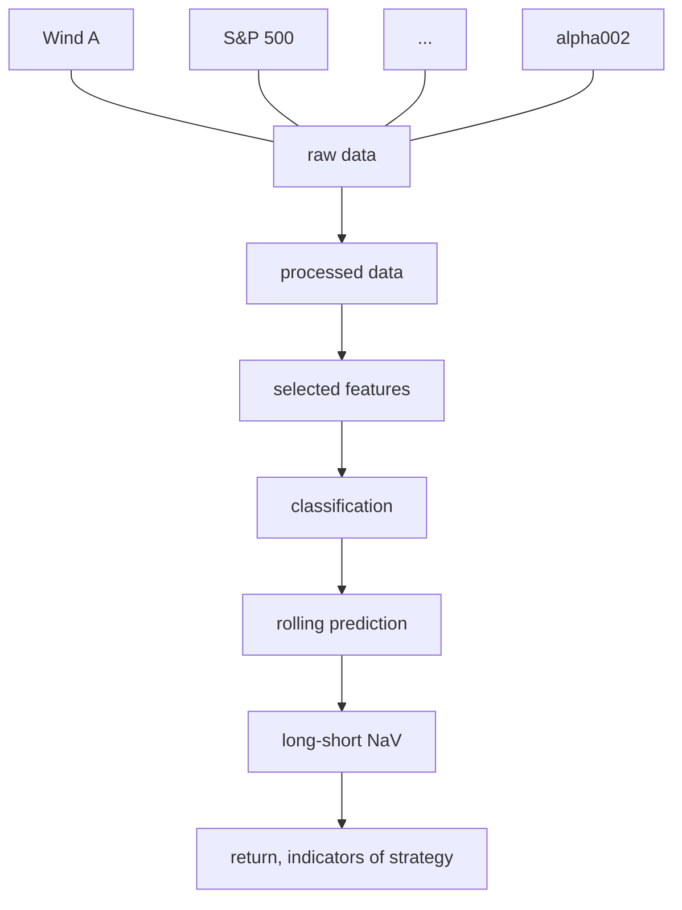

# PHBS_ML_for_quant_project
This is the repository for ML final project.

#### 0.Team Member

| Name                | Student ID | GitHub                                          |
| ------------------- | ---------- | ----------------------------------------------- |
| Yifan Hu/Evan       | 1901212691 | [eiahb3838ya](https://github.com/eiahb3838ya)   |
| Yuting Fang/Trista  | 1901212576 | [ytfang222](https://github.com/ytfang222)       |
| Zhihao Chen/Alfred  | 1901212567 | [AlfredChenZH](https://github.com/AlfredChenZH) |
| Zilei Wang/ Lorelei | 1901212645 | [LoreleiWong](https://github.com/LoreleiWong)   |

#### 1.Project Goal

As the global financial market is generating mass data of different types every day, it is becoming more crucial and more difficult to effectively extract and use these data to predict the trend of stocks. The short term timing strategy has a few difficulties as follows:

1. Market sentiments strongly influence the short-term market trend;
2. How to extract effective factors;
3. How to build nonlinear factors;
4. How to solve colinearity among factors.

Fortunately, the development of machine learning offers us a possible approach. In this project, we recognize the future rise or fall as a classification problem and implement several machine learning algorithms to predict the future rise or fall of Wind All A Index, an index indicating the trend of Chinese A Share stocks, to build a short-term timing investment strategy.

We implement a feature selection to choose 18 features (factors) out of 31 daily factor data and 8 alpha factors from WorldQuant101 to establish classifiers using logistic regression, naive Bayes, KNN, perceptron, decision tree, SVM, XGBoost and a Sequential neural network model in Keras to predict the rise or fall of Wind All A Index the next day. The time period of these data is from April 1, 2008 to March 6, 2020. The whole work flow is shown in Figure 1.

Figure 1. Work flow of the project

As the financial data are time series data, implementing a random splitting of training and testing data sets will lead to the use of future data, which makes the results of the models inaccurate. Therefore, we implement an expanding window backtest procedure as follows: 

1. We get at least 1800 days' data as the training dataset and implement different k-fold cross validation methods to tune the hyperparameters for the best model, so the first signal we can get in on February 24, 2015.
2. We implement the best model in the previous step to predict the rise or fall of Wind All A Index the next day. If the predicted signal is rise, then we buy Wind All A Index at the close of the day. If it is predicted to fall, then we short it at the close of the day.
3. We use the best model in Step 2 for 20 consecutive trading days and then add the 20 days' data into the training set in Step 1 to enter Step 1 again.

Figure 2. Flow chart of the expanding window backtest model for short-term timing strategy

As we can see from Figure 2, every 20 consecutive trading days the training dataset will expand 20 more days' data.

We will also use CSCV framework to evaluate the probability of overfitting in backtesting level.

#### 2.Data Selection

Dataset：According to the research report of Industrial Securities, we choose macroeconomic data([cleanedFactor.pkl](00%20data/cleanedFactor.pkl)) plus OHLC data of windA([881001.csv](00%20data/881001.csv)), and we add new data about index indicators, like ([DJI.GI,NQ.CME](00%20data/AddNewData)). The data can be acquired from Wind Database directly(Denoted by D in the table). All factors are based on daily frequency data.

Sample:

#### 3.Data clean details

1. **Data formats, structures**
   design a process for data cleaning. Remove NA values and make the format easy to slice according to time. Use dict and pandas dataframe to design our structure.
2. **Data Normalization**
   design a class for normalization work, which provides method including loading , calculating, saving data according to parameters given. At least implement two kinds of normalization, including min-max, z-score normalization.

#### 4. Explore and analysis data:

The description of dataset is in [report](08%20report/inputDataReport.html).

1. **Visualiztion**
   to check if our data follow required statistical assumptions, we will visualize our data using seaborn or other tools. Draw a heat map to check the corr_coef of each factors. 

2. **Feature engineering** use tech indicator to build some factor like wq101.

3. **Feature selection**
   to check which factors have better prediction power. We will apply feature selection methods including Cross Entropy, information gain, gini coef, LASSO. Draw the graph for each factor accordingly 

   Now(naive，SVCL1，tree，varianceThreshold，PCA)

4. **Check the efficiency of features** (waiting to do) calculate the IC

5. **Decomposition** We can try PCA method to avoid dimension disaster, pick the top 5, 10 vectors as our feature to input.

#### 5. Single Model to classifier

do cv. turning the hyperpramaters.

total num is  7 base classifier models.(Logistic Regression, SVM, KNN, Naive Bayes, NeuralNetwork,Perceptron,Decision Tree)

print output roc,auc,etc

#### 6.Boosting Model to implement model

XGBoost model performance is reeeeally good.

#### 7.Deep Learning algos to predict

Use sequential Model to make classifier. This case is not very suitable for deep learning algos because of small size of dataset.

#### 8.Evaluation overfitting framework

CSCV cross validation framework to evaluate the overfitting rate of each method.

#### Reference

meeting log url:https://hackmd.io/maqBPlJXQCuxeWJi7ga5AA?both
